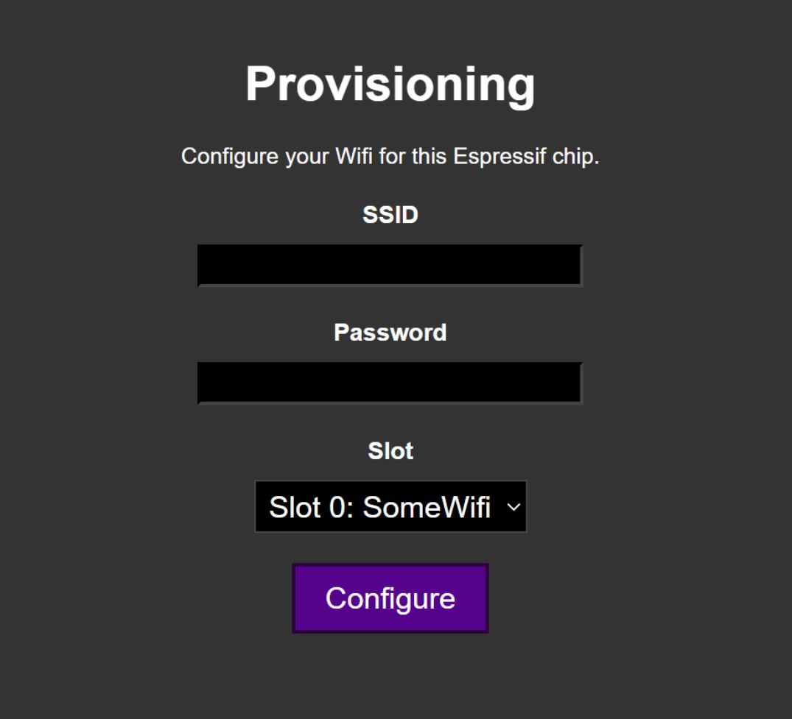
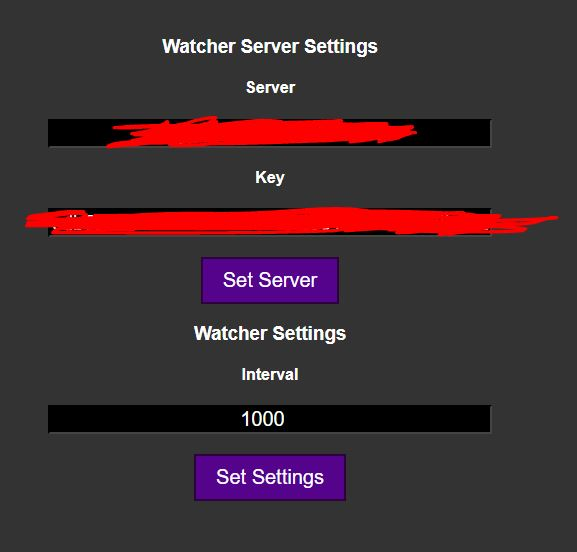

# ESP32Watcher
ESP32-Cam firmware that provides multi-wifi provisioning, basic configuration and uploading pictures to a server.

# Work in Progress
There are some bugs, and it may not work when provided unexpected input. If you get yourself into an invalid configuration, there is a constant in main.c to delete all configs on launch.

# Provisioning
When the firmware cannot find any known AP points, it will go into provisioning mode, allowing you to connect to it's wifi and configure it at 192.168.4.1.
It allows up to n wifi points to be configured (n is a constant in main.c)

# Configuration
After provisioning, you can connect to the device directly to set an endpoint and a key to upload images to.
Images will be uploaded with a POST: {server}/upstream/upload?key={key} with the image as body.
Interval species the delay between pictures (This does not include the time it takes to upload it)
I will probably provide the repository for the server at some point, atm some of the dependencies are not yet ready for publishing.

# Quality
All pictures are by default taken at 1600x1200 with a compression of 20/64. You can edit it in cam.c.
